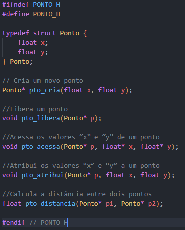

# Aula 02 - Modularização e TAD

A convenção em linguagem C é preparar dois arquivos para implementar um “TAD”.

- Arquivo “.H”: protótipos das funções, tipos de ponteiro, e dados globalmente acessível
- Arquivo “.C”: declaração do tipo de dados e implementação das suas funções.

Assim separamos o “conceito” (definição do tipo) de sua “implementação”

Exemplo de “TAD”: um ponto definido por suas coordenadas “x” e “y”.

`struct ponto{`

`float x;`

`float y;`

`};` 

1º Passo: definir o arquivo “.H”

- protótipos das funções
- tipos de ponteiro
- dados globalmente acessível

2º Passo: definir o arquivo “.C”

- implementar as funções do protótipo

3º Passo: teste das implementações usando a main.c:

Resultado Final:

