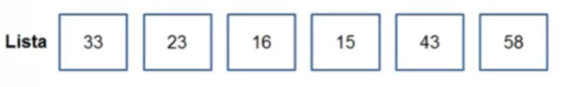

# Aula 03 - Listas Definição

Uma estrutura do tipo “Lista” é uma sequência de elementos do mesmo tipo. Seus elementos possuem estrutura interna abstraída, ou seja, sua complexidade é arbitrária e não afeta o seu funcionamento.

Uma “Lista” pode possuir N (N ≥ 0) elementos.

Se N = 0, dizemos que a “Lista” está vazia.

Aplicações:

- Cadastro de funcionários.
- Itens em estoque.
- Cartas de baralho.
- Etc.

Em uma “Lista” podemos realizar as seguintes operações básicas:

- Criação da lista.
- Inserção de um elemento.
- Exclusão de um elemento.
- Acesso a um elemento.
- Destruição da lista.
- Etc.

Essas operações dependem do tipo de alocação de memória usada:

- Estática.
- Dinâmica.

## Alocação Estática

- O espaço de memória é alocado no momento da compilação.
- Exige a definição do número máximo de elementos da “Lista”.
- Acesso sequencial: elementos consecutivos na memória.

## Alocação Dinâmica

- O espaço de memória é alocado em tempo de execução.
- A “Lista” cresce à medida que novos elementos são armazenados, e diminui à medida que elementos são removidos.
- Acesso encadeado: cada elemento pode estar em uma área distinta da memória. Para acessar um elemento, é preciso percorrer todos os seus antecessores na “Lista”.

